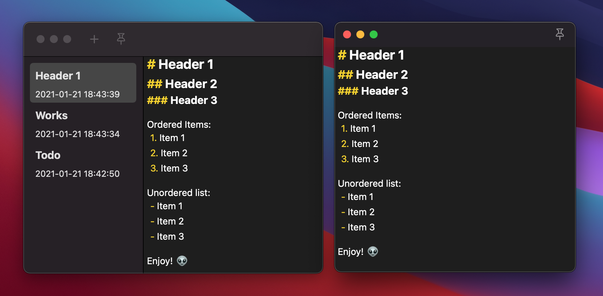

# Introduction

A convenient, clean memo app for macOS.

 

# Usage

- Press `cmd+shift+d` to quickly create a memo on the top of screen.
- Double clicking content for entering or press `ESC` for existing the edit mode.

# Acknowledge

- Intergrate [HotKey](https://github.com/soffes/HotKey) package.

# Todo

- Drag window directly by content view.
- Some simple markdown sign support.
- Store & manage memos with dashboard.
