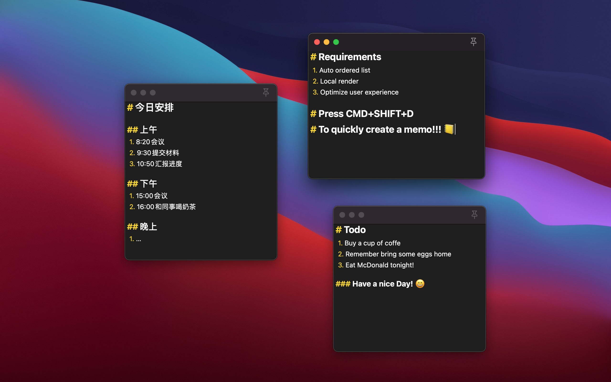

# Welcome to TapMemo support page

TapMemo is a convenient, clean memo app for macOS.

## Usage

### Writing With Memo

- Try tapping default key `CMD+SHIFT+D` to create a clean memo.
- Support basic markdown syntax including:
  - Headers level 1~3
  - ordered list
  - unordered list
- Saving status is shown on the top right.
- Clicking `pin` icon to decide whether the memo should pin on the screen or can be covered by other windows.
- Tapping `CMD+S` or `ESC` to save the memo and exit editing mode.
- Double cliking text field to enter editing mode.

### Manage Memos

- Manage your memos with dashboard by selecting `Memos` on status bar icon.
- Click `+` button to create a new blank memo on dashboard.
- Click `pin` icon to pin the selected memo on screen.
- A `*` on the right side of title indicates its **unsaved** status.

- Swipe left to delete the memo.

### Set Hotkey

The default hotkey is `CMD+SHIFT+D`, you can change it by clicking `Preferences` on the status bar icon.

## Contact

If you have any suggestions or issues, contact me on ooonefolder@gmail.com or github [issue page](https://github.com/hagemon/TapMemo/issues).

Codes are avaliable on my [github](https://github.com/hagemon/TapMemo).

Enjoy!

## Todo list
- Support local render
- Support nesting syntax for Markdown.
